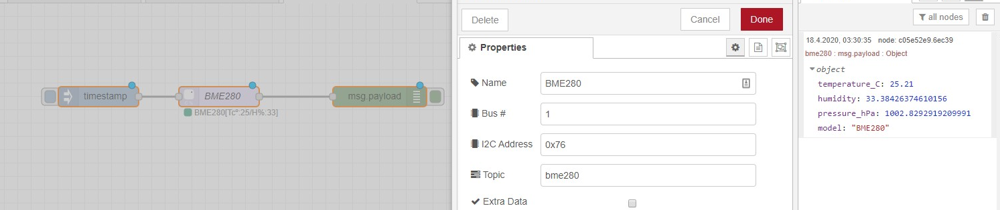

WG-Node-Red
===========

## Networkprinte MFC-8460N to WG-PI-FTP to Telegram


## PI Sensor BME280

Man muss beim PI das Interface einschalten.

**01.** ``sudo raspi-config ``

**02.** Interfacing Options >> I2C >> enabled

**03.** ``sudo reboot``

---

Raspberry Pi 3 Model B+ Steckleiste ist SDA & SLC (i2c-1)

Um die Adresse zu finden kann man das Tool benutzen [npm install i2c-bus
](https://github.com/fivdi/i2c-bus)

```bash
i2cdetect -y <busnum>
```


---



npm install node-red-contrib-bme280

---

